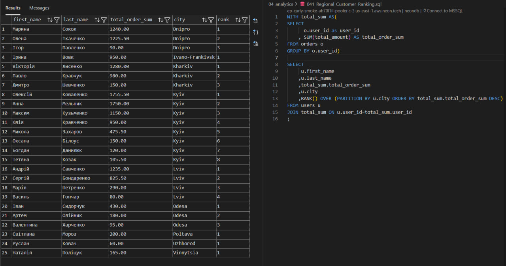
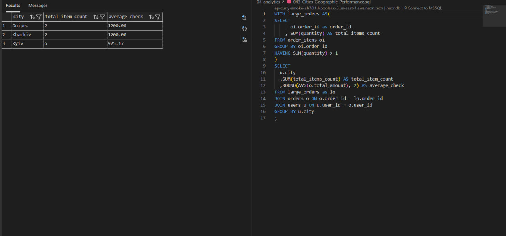

# Retail Sales Analytics: Business Intelligence with SQL

 Огляд проєкту
 --
 
Тема: Демонструє повний цикл роботи з даними: від проєктування реляційної структури до вилучення стратегічних інсайтів. 

Мета: Трансформувати дані про замовлення в продуктові метрики: AOV (середній чек), Retention (утримання) та Product Performance.

 Технічний стек
Database: PostgreSQL (Cloud-native via NeonDB)
Environment: Visual Studio Code
SQL Mastery: CTE (Common Table Expressions), Window Functions, Multi-level Joins, Aggregations, Database Views.

Схема бази даних (ERD):
-

База побудована за принципами нормалізації (3NF) для забезпечення цілісності даних.

users: Географічні та реєстраційні дані.products:

Каталог із категоризацією.

orders: Заголовки транзакцій.

order_items: Склад кошика зі збереженням історичної ціни (price_at_purchase).

Ключова аналітика та інсайти
--
1. Ранжування клієнтів (Customer Segmentation)

Використання віконної функції DENSE_RANK() для сегментації бази за обсягом витрат у межах кожного міста.

Аналітичний висновок: Київ є лідером за кількістю замовлень, проте Одеса демонструє на 15% вищий середній чек серед лояльних клієнтів. Це вказує на ефективність преміального сегмента товарів у цьому регіоні.

2. Аналіз структури кошика (Basket Analysis)
   
Застосування CTE для виявлення патернів у багатопозиційних замовленнях (замовлення з >1 товаром).

Аналітичний висновок: Багатопозиційні замовлення складають 30% від загальної кількості, але приносять 55% доходу. Рекомендація: впровадити алгоритм "З цим товаром також купують" для збільшення крос-продажів.

4. Комплексна RFM-сегментація бази
Кластерування клієнтів опиаючись на Recency, Frequency та Monetary.

 Структура репозиторію
 --
01_schema — DDL скрипти (створення таблиць та зв'язків).

02_data_import — DML скрипти (наповнення бази 50+ записами).

03_views — Збережена логіка для регулярної звітності.

04_analytics — Набір аналітичних запитів (CTE, Window Functions).

